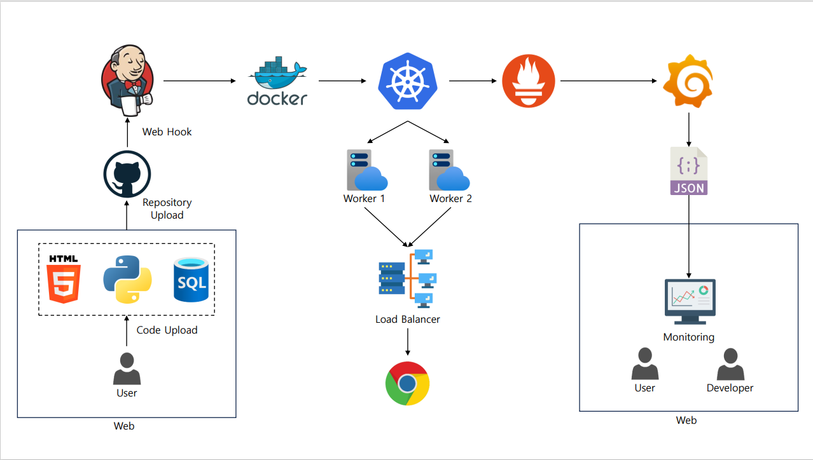

## 프로젝트 소개
**인프라나 이중화 구성을 모르는 사용자도 무중단 서비스를 제공할 수 있게 도와주는 SaaS 플랫폼**

 배포할 코드와 기타 요구 파일을 업로드하면 서비스가 자동으로 배포되며 이중화 구조로 장애가 발생해도 중단되지 않는 환경을 만들어 준다.

## 사용 툴
   

   

 
 
 

## 주요 기능
### 무중단 서비스
배포한 애플리케이션이 장애가 발생해도 중단 없이 실행되도록 Kubernetes에서 2개의 워커노드와 로드밸런서로 이중화하여 무중단 서비스를 제공한다.
### 사용자의 애플리케이션 배포 자동화
사용자의 코드 파일을 받아 Jenkins를 활용한 CI/CD를 통해 서비스를 자동으로 배포한다.
### 배포된 컨테이너 관리
사용자는 웹을 통해 배포한 컨테이너의 목록 조회, 특정 컨테이너 모니터링, 배포 중단/업데이트 등의 기능을 사용할 수 있다.
### 모니터링
배포된 컨테이너의 정보를 모니터링하며 사용된 리소스량과 배포 상태를 시각적으로 확인할 수 있다.
### 데이터베이스 관리
NFS 서버에서 데이터베이스를 관리하여 장애 발생 시 신속하게 대처할 수 있으며 데이터베이스의 손실을 방지할 수 있다.

## Process

1. 웹에서 사용자 코드와 요구 파일을 .zip으로 업로드
2. 파일을 unzip하여 github에 사용자마다 디렉토리 생성하여 push
3. Jenkins Webhook으로 파이프라인 실행
4. 디렉토리에 업로드 된 코드와 Dockerfile 등으로 이미지 build
5. 사용자마다 DB 관리를 위한 NFS-PV 생성
6. build된 이미지로 Kubernetes에 이중화 구성으로 배포 
7. 웹에서 배포된 컨테이너 모니터링

 

## 팀원
- 오정은(팀장) : Backend
- 안희주 : Frontend, Monitoring
- 이지우 : Kubernetes
- 윤동근 : Docker

