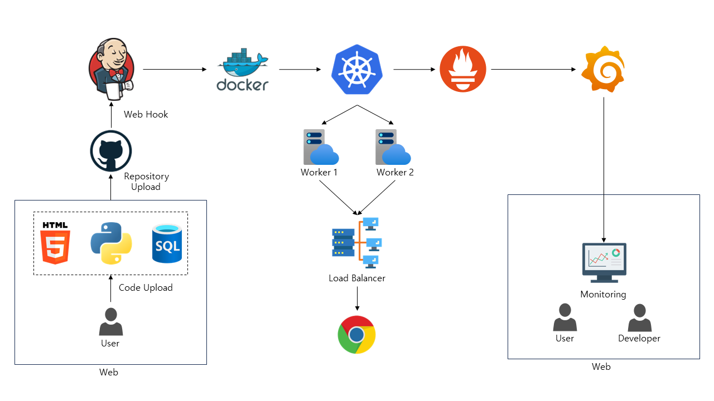

# NonStop4
오픈 인프라 개발 경진대회_자유주제

쿠버네티스를 활용한 자동 이중화 배포 서비스

## 프로젝트 소개
**인프라나 이중화 구성을 모르는 사용자도 무중단 서비스를 제공할 수 있게 도와주는 SaaS 플랫폼**

 배포할 코드를 업로드하면 서비스가 자동으로 배포되며 이중화 구조로 장애가 발생해도 중단되지 않는 환경을 만들어 준다.

## 사용 툴

      

    

 
 
 

## 주요 기능
### 무중단 서비스
배포한 애플리케이션이 장애가 발생해도 중단 없이 실행되도록 k8s에서 2개의 워커노드와 로드밸런서로 이중화하여 무중단 서비스를 제공한다.
### 사용자의 애플리케이션 배포 자동화
사용자의 코드 파일을 받아 Jenkins를 활용한 CI/CD를 통해 서비스를 자동으로 배포한다.
### 배포된 애플리케이션 관리
사용자는 웹을 통해 배포한 애플리케이션의 목록 조회, 특정 애플리케이션 모니터링, 배포 중단/업데이트 등의 기능을 사용할 수 있다.
### 모니터링
배포된 서비스의 정보를 모니터링하며 사용된 리소스량과 배포 상태를 시각적으로 확인할 수 있다.

## Process

1. 웹에서 사용자 코드를 .zip으로 업로드
2. 코드를 unzip하여 github에 사용자별 디렉토리 생성하여 push
3. Jenkins Webhook으로 파이프라인 실행
4. 디렉토리에 업로드 된 코드를 docker image build
5. 사용자 별 nfs-PV 볼륨 생성
6. build된 이미지로 k8s에 이중화 구성으로 배포 
7. 웹에서 배포된 서비스 모니터링

---

## 팀원
- 오정은(팀장) :
- 안희주
- 이지우
- 윤동근